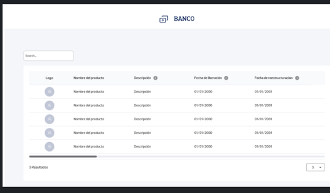
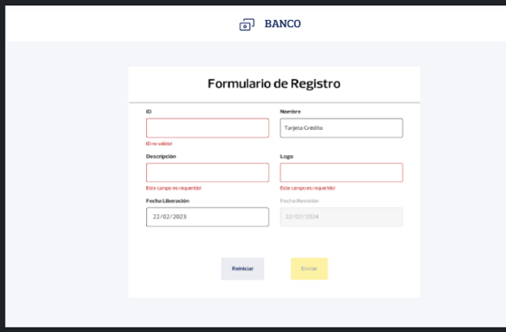
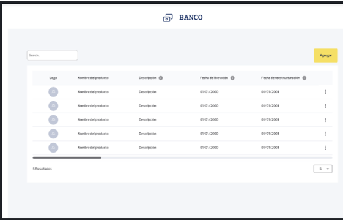
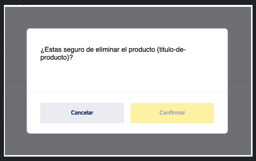
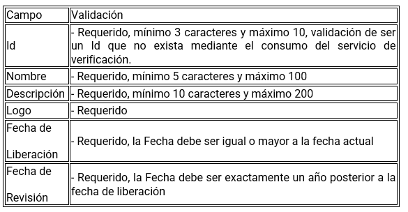

# EdisonCruz

Este proyecto fue generado con [Angular CLI](https://github.com/angular/angular-cli) versión 16.2.14.

## Instalación de dependencias

Para instalar las dependencias del proyecto, ejecuta el siguiente comando:

```bash
npm install
```

## Servidor de desarrollo

Ejecuta `ng serve` para iniciar un servidor de desarrollo. Navega a `http://localhost:4200/`. La aplicación se recargará automáticamente si cambias alguno de los archivos fuente.

```bash
ng serve
```

## Ejecución de pruebas unitarias

Ejecuta `npm run test` para ejecutar las pruebas unitarias a través de [Jest](https://jestjs.io/).

```code
npm run test
```

## Ejecución de pruebas con cobertura

Para ejecutar las pruebas unitarias con cobertura de código, utiliza el siguiente comando:

```bash
npm test -- --coverage
```

## Indicaciones

|     | Indicaciones generales                                                                                       |
| :-: | ------------------------------------------------------------------------------------------------------------ |
|  ✓  | Aplique todas las buenas prácticas, clean code, SOLID (se tomará en cuenta este punto para la calificación). |
|  ✓  | Se debe realizar el UI Development (Maquetación) sin usar frameworks de estilos o componentes prefabricados. |
|  ✓  | Se debe manejar excepciones y mostrar mensajes de errores visuales.                                          |
|  ✓  | Se debe realizar pruebas unitarias y contar con un mínimo de 70% coverage.                                   |

|     | Requerimiento de Microservicios y Funcionalidades                                 |
| :-: | --------------------------------------------------------------------------------- |
|     | Generar una aplicación frontend para cumplir las funcionalidades: F1, F2, F3, F4. |
|     | Es deseable la funcionalidad F5 y el uso de rutas.                                |

|     | Funcionalidades del Frontend                                                                                                                                                                                                                                                                                                                                                                                                                                                              |
| :-: | ----------------------------------------------------------------------------------------------------------------------------------------------------------------------------------------------------------------------------------------------------------------------------------------------------------------------------------------------------------------------------------------------------------------------------------------------------------------------------------------- |
|  ✓  | **F1. Listado de productos financieros:** Se requiere una aplicación para visualizar los diferentes productos financieros ofrecidos por la Institución Banco cargados desde una API. Realizar la maquetación en base al diseño D1.                                                                                                                                                                                                                                                        |
|  ✓  | **F2. Búsqueda de productos financieros:** Se requiere realizar búsqueda de los productos financieros mediante un campo de texto. Realizar la maquetación en base al diseño D1.                                                                                                                                                                                                                                                                                                           |
|  ✓  | **F3. Cantidad de registros:**                                                                                                                                                                                                                                                                                                                                                                                                                                                            |
|     | ✓ -- Se requiere que se muestre la cantidad de resultados mostrados en el listado y un select que permita seleccionar la cantidad de registros a mostrar debe contener los siguientes valores: 5, 10 y 20. Realizar la maquetación en base al diseño D1.                                                                                                                                                                                                                                  |
|     | X -- Es deseable agregar una paginación simple en caso de que haya un número considerable de registros.                                                                                                                                                                                                                                                                                                                                                                                   |
|  ✓  | **F4. Agregar producto:** Se requiere implementar un botón de "Agregar" para navegar al formulario de registro. El formulario debe permitir la creación de un producto mediante un botón "Agregar" y permitir la limpieza del formulario mediante un botón "Reiniciar". Realizar la maquetación del formulario según el diseño D2 y ubicación del botón principal según diseño D3. Cada campo del formulario contendrá su respectiva validación previa al envío del formulario Diseño D5. |
|  X  | **F5. Editar producto:** Se requiere implementar un menú contextual (dropdown) para editar cada producto. Al hacer clic, navegar a la pantalla de edición manteniendo el campo de ID deshabilitado. El formulario de edición debe mantener las mismas validaciones que F4 y mostrar errores visuales por cada campo. Realizar la maquetación del formulario de edición según diseño D2 y del menú de producto según diseño D3.                                                            |
|  ✓  | **F6. Eliminar producto:**                                                                                                                                                                                                                                                                                                                                                                                                                                                                |
|     | ✓ -- Se requiere la implementación una opción de eliminar dentro del menú contextual de cada producto, al hacer clic en la opción de eliminar se deberá mostrar un modal con un botón de “Cancelar” y un botón “Eliminar”, al hacer clic en Eliminar se debe proceder con la eliminación, en el caso de cancelar seria solo ocultar el modal                                                                                                                                              |
|     | X -- Realizar maquetación del menú de cada producto en base al diseño D3 y la maquetación del modal en base al diseño D4.                                                                                                                                                                                                                                                                                                                                                                 |

|     | Consideraciones Adicionales (para obtener la máxima puntuación) |
| :-: | --------------------------------------------------------------- |
|  ✓  | Implementación de las funcionalidades F5 y F6.                  |
|  ✓  | Consideración de rendimiento.                                   |
|  X  | Implementación de pantallas de precarga (Skeletons).            |
|  ✓  | Diseño responsivo.                                              |

## Diseños

### Diseño 1



### Diseño 2



### Diseño 3



### Diseño 4



### Diseño 5



_Nota:_ Cambiar a true los cors de la api.

## Further help

To get more help on the Angular CLI use `ng help` or go check out the [Angular CLI Overview and Command Reference](https://angular.io/cli) page.
